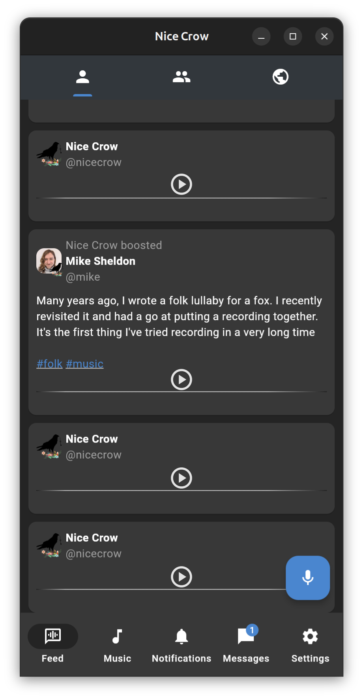

# Nice Crow

Nice Crow is an audio focused Fediverse project. It has two main streams of focus, voice notes and music. The idea is that you should be able to listen to your social network like a series of micro-podcasts, and enjoy the music created by Fediverse citizens.

Users can designate specific tags as being music, e.g. #folk, #rock, #edm. These can then be treated differently to normal posts. While they can still be optionally played as part of the main feed, they are also accessible via a separate 'Music' tab, which behaves more like a traditional audio player, allowing users to replay songs, tune in to specific tag 'stations', play only posts that they have favourited, etc.

Nice Crow will also gather statistics on a user's most played artists, so that it can direct them to purchase music from the artist directly.
